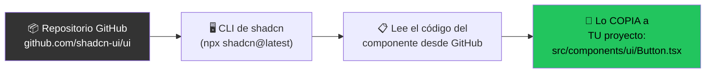

# 🦇 shadcn/ui: Todas tus preguntas respondidas (aplicado a Vitka)

---

## 1. ¿De dónde se descarga ese botón? ¿Dónde vive?

### El flujo completo:



**No es un paquete NPM.** El código fuente de todos los componentes vive en el repositorio de GitHub de shadcn:
- 🔗 **Repo**: [github.com/shadcn-ui/ui](https://github.com/shadcn-ui/ui)
- 🔗 **Catálogo visual**: [ui.shadcn.com](https://ui.shadcn.com)

Cuando ejecutás `npx shadcn@latest add button`, el CLI:
1. **Lee** el código del componente Button desde el repo/registry
2. **Lo copia** a tu carpeta `src/components/ui/Button.tsx`
3. **Instala** automáticamente las dependencias necesarias (ej: Radix UI para modales)

Después de eso, el CLI ya no tiene nada que ver. **El archivo es tuyo.**

> [!IMPORTANT]
> shadcn/ui sí instala algunas dependencias reales en `node_modules` (como `@radix-ui/react-dialog` para un Modal), pero el **componente en sí** (el archivo `.tsx` con los estilos Tailwind) se copia a tu proyecto. La parte visual es tuya; la parte de accesibilidad viene de Radix.

---

## 2. ¿Por qué Vitka NO usa shadcn/ui?

Analicé tu proyecto completo. Vitka tiene **4 componentes** y **4 páginas**, todos escritos a mano con Tailwind puro:

| Componente | Líneas | ¿Qué hace? |
|---|---|---|
| [`CourseCard.jsx`](file:///c:/Users/Dano/Desktop/Antigravity%202.0/Vitka/src/components/CourseCard.jsx) | 61 | Card con progress bar, badge, ícono |
| [`Quiz.jsx`](file:///c:/Users/Dano/Desktop/Antigravity%202.0/Vitka/src/components/Quiz.jsx) | 363 | Sistema de evaluación con timer, modal de confirmación |
| [`SlideView.jsx`](file:///c:/Users/Dano/Desktop/Antigravity%202.0/Vitka/src/components/SlideView.jsx) | 190 | Visor de diapositivas con navegación |
| [`AiChat.jsx`](file:///c:/Users/Dano/Desktop/Antigravity%202.0/Vitka/src/components/AiChat.jsx) | 758 | Chat con IA, panel de configuración |

**¿Por qué no usa shadcn?** Probablemente porque:
1. Vitka se construyó con componentes custom muy específicos (un quiz con timer no existe en shadcn)
2. El proyecto es relativamente pequeño (4 componentes)
3. Usa Tailwind v4 (`"tailwindcss": "^4.3.2"`) — shadcn tiene soporte para v4 pero históricamente se desarrolló para v3

---

## 3. ¿En cuáles componentes de Vitka PODRÍA usarse shadcn?

Mirando tu código, hay **patrones repetidos** que shadcn resolvería mejor:

### ✅ Candidatos claros:

| Patrón repetido en Vitka | Componente shadcn | ¿Dónde se repite? |
|---|---|---|
| **Botones** con variantes (primario, destructivo, outline) | `Button` | Quiz (Iniciar, Siguiente, Reintentar), Login, SlideView (Anterior/Siguiente) |
| **Modal de confirmación** (salir del quiz) | `AlertDialog` | Quiz líneas 179-209: modal "¿Estás seguro de salir?" |
| **Cards** con bordes, sombras, hover | `Card` | CourseCard, panel de resultados del Quiz |
| **Progress bars** | `Progress` | CourseCard (progreso del curso), SlideView (barra superior), Quiz (pregunta X de Y) |
| **Badges** | `Badge` | CourseCard (badge "Próximamente") |
| **Inputs y Textareas** | `Input`, `Textarea` | AiChat (input del mensaje) |
| **Select/Dropdown** | `Select` | AiChat (selector de provider: OpenAI/Anthropic/Google) |
| **Dialog/Sheet** | `Dialog`, `Sheet` | AiChat (panel de configuración), modal de borrar historial |
| **Tooltip** | `Tooltip` | Botones de navegación con `title="..."` |

### 📊 Ejemplo concreto: tu modal de salida del Quiz

**Tu código actual** ([Quiz.jsx líneas 179-209](file:///c:/Users/Dano/Desktop/Antigravity%202.0/Vitka/src/components/Quiz.jsx#L179-L209)):
```jsx
{/* 30 líneas de JSX para un modal de confirmación */}
{showExitConfirm && (
  <div className="fixed inset-0 z-[200] bg-black/80 flex items-center justify-center p-4">
    <div className="bg-gray-900 border border-gray-800 rounded-2xl p-8 max-w-md w-full shadow-2xl text-center space-y-6">
      <AlertTriangle ... />
      <h3>¿Estás seguro de salir?</h3>
      <p>Perderás todo tu progreso...</p>
      <button onClick={() => setShowExitConfirm(false)}>Cancelar</button>
      <button onClick={resetAndExit}>Sí, salir</button>
    </div>
  </div>
)}
```

**Con shadcn** `AlertDialog`:
```jsx
{/* 12 líneas, accesible, con animaciones y Focus Trap incluidos */}
<AlertDialog open={showExitConfirm} onOpenChange={setShowExitConfirm}>
  <AlertDialogContent>
    <AlertDialogHeader>
      <AlertDialogTitle>¿Estás seguro de salir?</AlertDialogTitle>
      <AlertDialogDescription>Perderás todo tu progreso actual.</AlertDialogDescription>
    </AlertDialogHeader>
    <AlertDialogFooter>
      <AlertDialogCancel>Cancelar</AlertDialogCancel>
      <AlertDialogAction onClick={resetAndExit}>Sí, salir</AlertDialogAction>
    </AlertDialogFooter>
  </AlertDialogContent>
</AlertDialog>
```

> [!TIP]
> La versión shadcn además incluye **gratis**: cierre con tecla Escape, Focus Trap (el tab no se va del modal), overlay animado, y accesibilidad completa para lectores de pantalla. Todo eso en tu Quiz actual habría que programarlo manualmente.

---

## 4. Paso a paso: Cómo instalar shadcn/ui en Vitka

> [!WARNING]
> Tu proyecto usa **Tailwind v4** (`^4.3.2`). shadcn tiene soporte para v4, pero el proceso de init es ligeramente distinto al de v3. Seguí estos pasos exactos.

### Paso 1: Inicializar shadcn en el proyecto

```bash
cd "c:\Users\Dano\Desktop\Antigravity 2.0\Vitka"
npx shadcn@latest init
```

El CLI te va a preguntar:
- **Style**: `New York` (más moderno) o `Default`
- **Base color**: elegí uno (ej: `Zinc` para dark mode)
- **CSS variables**: `Yes`

Esto crea:
- `components.json` — configuración de shadcn
- `src/lib/utils.ts` — función `cn()` para combinar clases
- Actualiza tu CSS con variables de colores

### Paso 2: Agregar un componente

```bash
# Agregar un botón
npx shadcn@latest add button

# Agregar un modal de confirmación
npx shadcn@latest add alert-dialog

# Agregar una card
npx shadcn@latest add card

# Agregar un progress bar
npx shadcn@latest add progress

# Agregar un badge
npx shadcn@latest add badge
```

Cada comando **copia** el archivo `.tsx` a `src/components/ui/`:

```
src/
  components/
    ui/               ← ¡NUEVA CARPETA creada por shadcn!
      button.tsx
      alert-dialog.tsx
      card.tsx
      progress.tsx
      badge.tsx
    CourseCard.jsx     ← tus componentes originales
    Quiz.jsx
    SlideView.jsx
    AiChat.jsx
```

### Paso 3: Usar el componente

```jsx
// Importar desde tu propia carpeta (NO desde node_modules)
import { Button } from '@/components/ui/button';
import { AlertDialog, AlertDialogContent, ... } from '@/components/ui/alert-dialog';

// Usar como cualquier componente React
<Button variant="destructive" size="lg">
  Sí, salir
</Button>
```

### Paso 4 (opcional): Personalizar

Como el archivo es tuyo, simplemente lo abrís y lo editás:

```tsx
// src/components/ui/button.tsx — PODÉS EDITARLO
const buttonVariants = cva("...", {
  variants: {
    variant: {
      default: "bg-primary text-background-dark",     // ← cambiar colores de Vitka
      destructive: "bg-red-500/20 text-red-400",      // ← tu estilo actual
      vitka: "bg-primary hover:bg-primary/90 font-bold", // ← ¡variante custom!
    }
  }
});
```

---

## 5. ¿Dónde puedo VER los componentes antes de instalarlos?

### Catálogo oficial:

| Recurso | URL | ¿Qué muestra? |
|---|---|---|
| **shadcn/ui oficial** | [ui.shadcn.com](https://ui.shadcn.com/docs/components) | Catálogo completo con preview + código |
| **shadcn/ui Themes** | [ui.shadcn.com/themes](https://ui.shadcn.com/themes) | Temas de colores pre-hechos |
| **shadcn/ui Examples** | [ui.shadcn.com/examples](https://ui.shadcn.com/examples) | Dashboards, forms, cards completos |

### Alternativas y complementos:

| Librería | Tipo | ¿Qué es? |
|---|---|---|
| [Radix UI](https://www.radix-ui.com) | Headless (sin estilos) | Los "cerebros" que shadcn usa por debajo (accesibilidad pura) |
| [Headless UI](https://headlessui.com) | Headless (sin estilos) | Similar a Radix, del equipo de Tailwind |
| [DaisyUI](https://daisyui.com) | Plugin Tailwind | Componentes como clases CSS (`class="btn btn-primary"`) — NO copia archivos |
| [Aceternity UI](https://ui.aceternity.com) | Componentes animados | Efectos de scroll, parallax, animaciones premium |
| [Magic UI](https://magicui.design) | Componentes animados | Componentes con animaciones espectaculares |

---

## 6. Los 10 componentes más usados de shadcn

Ordenados por frecuencia de uso en proyectos reales:

| # | Componente | ¿Para qué? | Comando |
|---|---|---|---|
| 1 | **Button** | Botones con variantes | `npx shadcn@latest add button` |
| 2 | **Card** | Containers con header/content/footer | `npx shadcn@latest add card` |
| 3 | **Dialog** | Modales/popups | `npx shadcn@latest add dialog` |
| 4 | **Input** | Campos de texto estilizados | `npx shadcn@latest add input` |
| 5 | **Select** | Dropdowns accesibles | `npx shadcn@latest add select` |
| 6 | **Badge** | Etiquetas/tags | `npx shadcn@latest add badge` |
| 7 | **Toast/Sonner** | Notificaciones temporales | `npx shadcn@latest add sonner` |
| 8 | **Tooltip** | Texto al pasar el mouse | `npx shadcn@latest add tooltip` |
| 9 | **Tabs** | Navegación por pestañas | `npx shadcn@latest add tabs` |
| 10 | **Alert Dialog** | Confirmación destructiva | `npx shadcn@latest add alert-dialog` |

---

## 🏁 Resumen

> **shadcn/ui no vive en NPM — vive en GitHub. El CLI lo copia a tu carpeta `src/components/ui/`. Tu proyecto Vitka no lo usa, pero podría beneficiarse en los botones, modales, progress bars, badges, inputs y selects que hoy están escritos a mano. Para instalarlo: `npx shadcn@latest init` + `npx shadcn@latest add [componente]`. Después, el archivo es tuyo y lo personalizás directo.**
